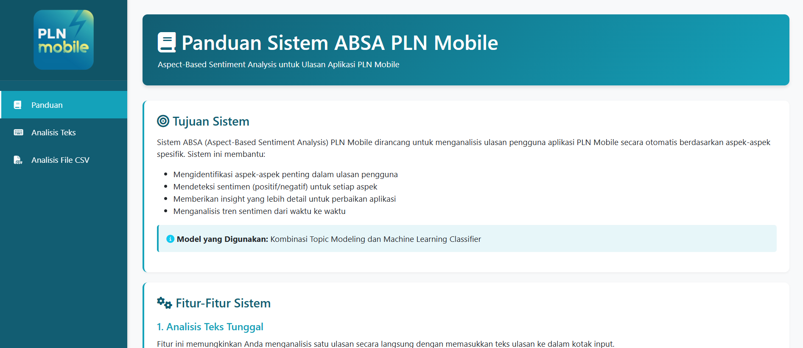
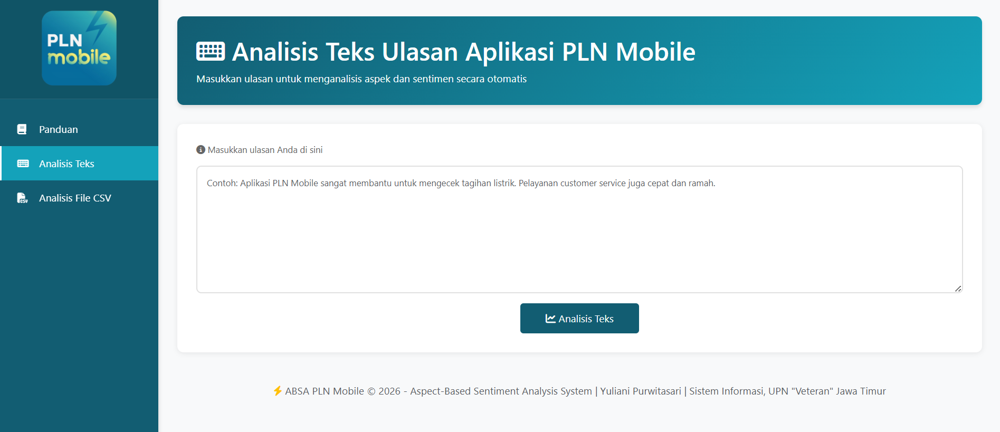
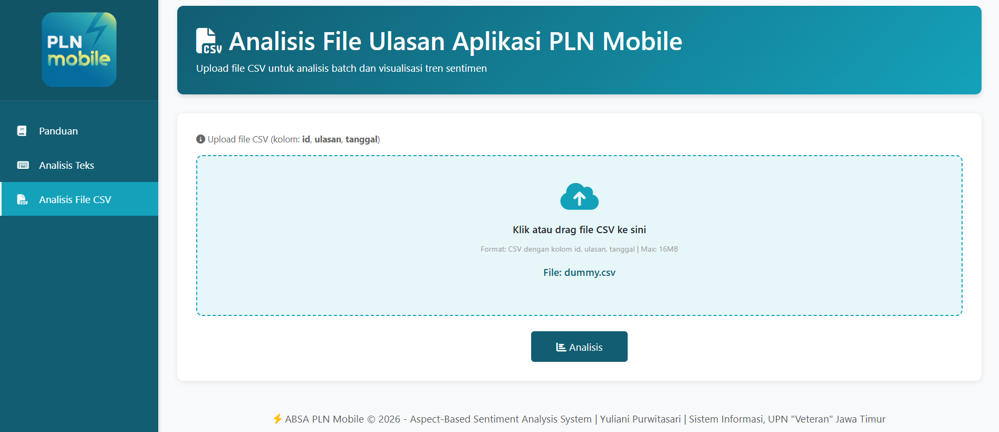
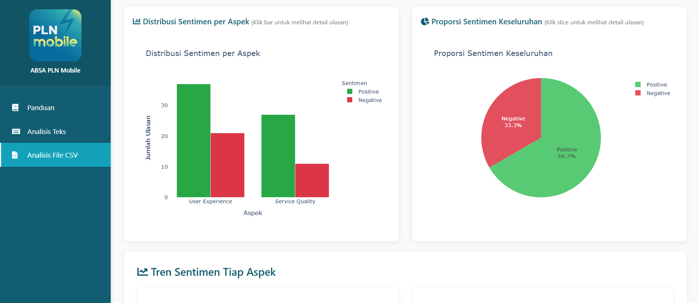
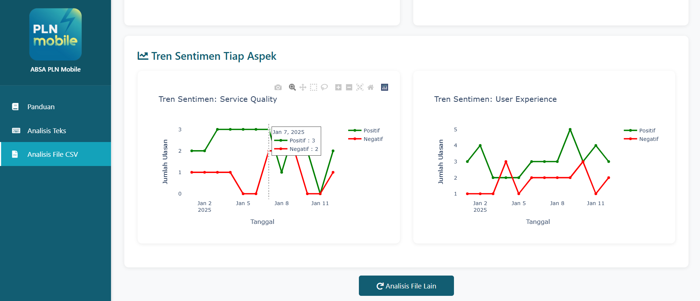
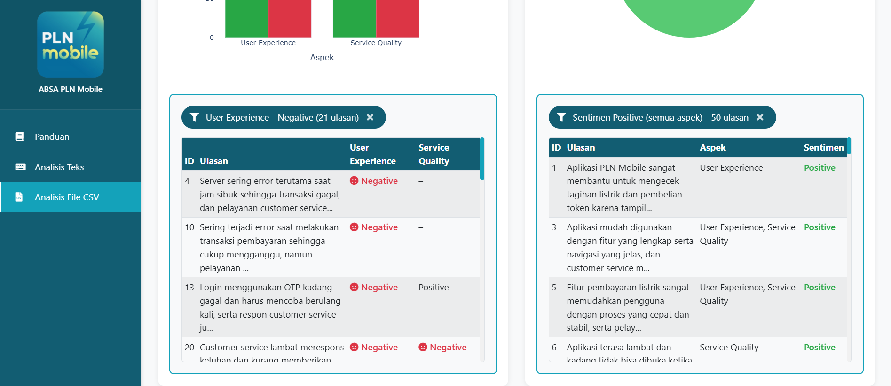
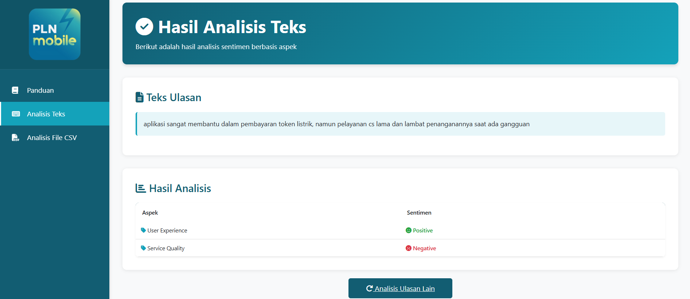
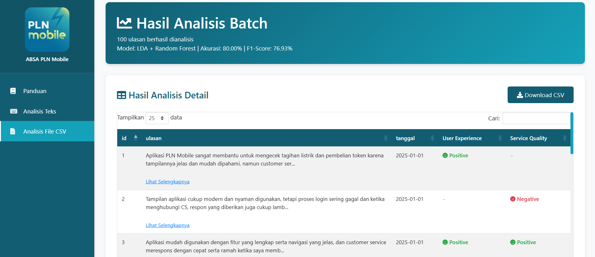

# ABSA-PLN-Mobile
Aspect Based Sentiment Analysis System on PLN Mobile Application Reviews
# ABSA PLN Mobile - Aspect-Based Sentiment Analysis System


Sistem analisis sentimen berbasis aspek (Aspect-Based Sentiment Analysis) untuk ulasan aplikasi PLN Mobile menggunakan metode LDA (Latent Dirichlet Allocation) untuk topic modeling dan Random Forest untuk klasifikasi sentimen.

## 📋 Deskripsi

ABSA PLN Mobile adalah sistem yang dirancang untuk menganalisis ulasan pengguna aplikasi PLN Mobile dengan mengidentifikasi aspek-aspek tertentu (User Experience dan Service Quality) serta sentimen yang terkait dengan setiap aspek (Positive atau Negative). Sistem ini menggunakan kombinasi **LDA + Random Forest dengan teknik SMOTE+Tomek Links** yang mencapai:

- **Akurasi**: 80.00%
- **F1-Score Macro**: 76.93%
- **Precision Macro**: 78.04%
- **Recall Macro**: 76.63%

## ✨ Fitur Utama

### 1. Analisis Teks Tunggal
- Input satu ulasan secara langsung
- Prediksi real-time aspek dan sentimen
- Visualisasi hasil dengan color coding (Hijau: Positive, Merah: Negative)

### 2. Analisis File CSV (Batch Processing)
- Upload file CSV berisi banyak ulasan
- Analisis batch dengan progress tracking
- Hasil prediksi dalam tabel interaktif dengan fitur:
  - Search & filter
  - Sorting per kolom
  - Pagination
  - Export ke CSV

### 3. Visualisasi Data Interaktif
- **Bar Chart**: Distribusi sentimen per aspek
- **Pie Chart**: Proporsi sentimen keseluruhan
- **Line Chart**: Tren sentimen dari waktu ke waktu (jika data tanggal tersedia)
- **Interactive Charts**: Klik chart untuk filter dan lihat detail ulasan

### 4. Download & Export
- Download hasil analisis dalam format CSV
- File dengan encoding UTF-8 + BOM untuk kompatibilitas Excel
- Timestamp otomatis pada nama file

## 🛠️ Teknologi yang Digunakan

### Machine Learning
- **Topic Modeling**: Latent Dirichlet Allocation (LDA)
- **Classifier**: Random Forest
- **Handling Imbalanced Data**: SMOTE + Tomek Links
- **Feature Extraction**: TF-IDF (max_features=5000, ngram_range=(1,2))
- **Hyperparameter Tuning**: GridSearchCV dengan 5-fold Cross-Validation

### Backend
- **Framework**: Flask 2.0+
- **Data Processing**: Pandas, NumPy
- **ML Library**: scikit-learn, imbalanced-learn
- **Model Persistence**: joblib

### Frontend
- **UI Framework**: Bootstrap 4
- **Visualization**: Plotly.js
- **Tables**: DataTables
- **Icons**: Font Awesome 5

# 📸 System Visualization

---

## 📖 User Guide
<p align="center">
  
</p>

## 🔍 Text Analysis
<p align="center">
  
</p>

This feature allows users to analyze individual PLN Mobile reviews and predict sentiments based on identified aspects in real time.

---

## 📂 File Analysis
<p align="center">
  
</p>

Users can upload CSV files containing multiple PLN Mobile reviews for batch sentiment analysis and automated processing.

---

## 📊 Bar Chart & Pie Chart Visualization
<p align="center">
  
</p>

Interactive charts visualize sentiment distribution and aspect proportions to help users understand overall review trends.

---

## 📈 Line Chart Analysis
<p align="center">
  
</p>

Line chart visualization used to monitor sentiment trends over time based on review dates.

---

## 📉 Detailed Line Chart
<p align="center">
  
</p>

Detailed line chart analysis provides deeper insight into PLN Mobile user sentiment patterns and fluctuations.

---

## ✅ Text Analysis Result
<p align="center">
  
</p>

Displays prediction results for aspect categories and sentiment polarity from single text analysis.

---

## ✅ File Analysis Result
<p align="center">
  
</p>

Shows sentiment classification results from uploaded datasets along with filtering and export features.


## 📁 Struktur Folder

```
ABSA-PLN-Mobile/
├── app.py                          # Main Flask application
├── requirements.txt                # Python dependencies
├── README.md                       # Documentation
│
├── models/                         # Trained models
│   ├── best_tfidf_vectorizer.pkl   # TF-IDF vectorizer
│   ├── best_models.pkl             # 4 Random Forest models (one per label)
│   ├── best_mlb.pkl                # MultiLabelBinarizer
│   └── best_model_info.json        # Model metadata & metrics
│
├── templates/                      # HTML templates
│   ├── index.html                  # Landing page
│   ├── analisis_teks.html          # Single text analysis
│   ├── analisis_csv.html           # CSV upload page
│   ├── result_single.html          # Single text result
│   └── result_batch.html           # Batch analysis result
│
├── static/                         # Static assets
│   ├── css/
│   ├── js/
│   └── images/
│       └── logo.png                # PLN Mobile logo
│
├── uploads/                        # Temporary upload folder (auto-created)
```

## 🚀 Instalasi

### Prerequisites
- Python 3.11 atau lebih tinggi
- pip package manager
- Virtual environment (recommended)

### Langkah Instalasi

1. **Clone repository**
```bash
git clone https://github.com/ririsariii/ABSA-PLN-Mobile.git
cd ABSA-PLN-Mobile
```

2. **Buat virtual environment**
```bash
# Windows
python -m venv venv
venv\Scripts\activate

# Linux/Mac
python3 -m venv venv
source venv/bin/activate
```

3. **Install dependencies**
```bash
pip install -r requirements.txt
```

4. **Pastikan folder models berisi file-file berikut:**
- `best_tfidf_vectorizer.pkl`
- `best_models.pkl`
- `best_mlb.pkl`
- `best_model_info.json`

5. **Jalankan aplikasi**
```bash
python app.py
```

6. **Akses aplikasi**
```
http://localhost:5000
```

## 📦 Dependencies

```
numpy==1.26.4
pandas==2.1.4
scikit-learn==1.6.1
joblib==1.5.3
Flask==3.0.0
Werkzeug==3.0.1
plotly==5.18.0
python-dateutil==2.8.2
```

## 📊 Model Information

### Dataset
- **Source**: Ulasan PLN Mobile dari Google Play Store dan Apple App Store (26 September-26 Oktober 2025)
- **Total Data**: 16,220 ulasan (setelah preprocessing)
- **Split Ratio**: 
  - Training: 80% (11.678 ulasan)
  - Testing: 20% ( 2.920 ulasan)
  - Validation: 10% dari total (1.622 ulasan)

### Aspek yang Dianalisis
1. **User Experience**: Aspek terkait pengalaman pengguna (UI/UX, navigasi, kemudahan penggunaan)
2. **Service Quality**: Aspek terkait kualitas layanan (customer service, responsivitas)

### Model Performance

| Metric | Train | Test | Validation |
|--------|-------|------|------------|
| Accuracy | 86.23% | 80.00% | 79.59% |
| Precision (Macro) | 85.54% | 78.04% | 72.39% |
| Recall (Macro) | 84.01% | 76.63% | 75.83% |
| F1-Score (Macro) | 84.77% | 76.93% | 73.95% |
| Hamming Loss | 0.0421 | 0.0568 | 0.0580 |

**Overfitting Status**: ✅ NORMAL (Train-Test gap = 5.08% < 10% threshold)

## 💡 Cara Penggunaan

### 1. Analisis Teks Tunggal

1. Klik menu **"Analisis Teks"** di sidebar
2. Masukkan ulasan di text area
3. Klik tombol **"Analisis"**
4. Lihat hasil prediksi untuk setiap aspek

**Contoh Input:**
```
Aplikasi mudah digunakan dan customer service ramah
```

**Output:**
- User Experience: 😊 Positive
- Service Quality: 😊 Positive

### 2. Analisis File CSV

1. Klik menu **"Analisis File CSV"** di sidebar
2. Siapkan file CSV dengan minimal kolom `id, ulasan, tanggal`
3. Upload file CSV (max 16 MB)
4. Klik **"Analisis"**
5. Lihat hasil dalam tabel & visualisasi
6. Download hasil dengan tombol **"Download CSV"**

**Format CSV:**
```csv
id,ulasan,tanggal
1,Aplikasi mudah digunakan,2025-01-01
2,Customer service lambat merespons,2025-01-02
```

### 3. Fitur Interaktif Chart

- **Klik Bar Chart**: Filter ulasan berdasarkan aspek dan sentimen tertentu
- **Klik Pie Chart**: Filter ulasan berdasarkan sentimen (semua aspek)
- **Klik X pada badge**: Tutup filter dan kembali ke view normal

## 🔧 Konfigurasi

Edit file `app.py` untuk mengubah konfigurasi:

```python
# Upload configuration
app.config['MAX_CONTENT_LENGTH'] = 16 * 1024 * 1024  # Max 16MB
app.config['ALLOWED_EXTENSIONS'] = {'csv'}

# Server configuration
app.run(debug=True, host='0.0.0.0', port=5000)
```

## 🧪 Testing

### Test dengan cURL

**Single Text Prediction:**
```bash
curl -X POST http://localhost:5000/api/predict \
  -H "Content-Type: application/json" \
  -d '{"text": "Aplikasi mudah digunakan tapi CS lambat"}'
```

**Response:**
```json
{
  "success": true,
  "data": {
    "raw_text": "Aplikasi mudah digunakan tapi CS lambat",
    "predictions": {
      "User Experience": "Positive",
      "Service Quality": "Negative"
    }
  }
}
```

## 📈 Model Training

Jika Anda ingin melatih ulang model:

1. Siapkan dataset dalam format CSV
2. Jalankan notebook di folder `notebooks/` secara berurutan
3. Model akan tersimpan di folder `models/`
4. Update `best_model_info.json` dengan metrik terbaru

**Training Pipeline:**
1. Preprocessing & Cleaning
2. LDA Topic Modeling (2 topics)
3. Feature Extraction (TF-IDF)
4. SMOTE + Tomek Links (resampling)
5. Random Forest Training (GridSearchCV)
6. Evaluation (Train/Test/Validation)

## 🐛 Troubleshooting

### Error: "Model files not found"
- Pastikan semua file `.pkl` dan `.json` ada di folder `models/`
- Check path dengan `ls models/` atau `dir models\`

### Error: "Address already in use"
- Port 5000 sudah digunakan, ganti port:
```python
app.run(debug=True, port=5001)  # Ganti ke port lain
```

### Error: "File too large"
- File CSV > 16 MB, compress atau split file
- Atau ubah `MAX_CONTENT_LENGTH` di `app.py`

### Chart tidak muncul
- Clear browser cache
- Check console browser (F12) untuk error
- Pastikan Plotly.js berhasil dimuat


## 📝 License

Distributed under the MIT License. See `LICENSE` file for more information.

## 👥 Authors

- **[Yuliani Purwitasari]** - *Initial work* - [GitHub Profile](https://www.linkedin.com/in/yuliani-purwitasari/)

## 🙏 Acknowledgments

- Dataset ulasan PLN Mobile dari Google Play Store dan Apple App Store pada rentang waktu 26 September hingga 26 Oktober 2025
- PLN (Perusahaan Listrik Negara) untuk studi kasus
- Dosen pembimbing skripsi : Eka Dyar Wahyuni, S.Kom.,M.Kom. dan Tri Luhur Indayanti Sugata, S.ST., M.IM.
- Komunitas open-source Python & Flask

## 📞 Kontak

- LinkedIn: (https://www.linkedin.com/in/yuliani-purwitasari/)
<<<<<<< HEAD
- Project Link: [https://github.com/ririsariii/ABSA-PLN-Mobile](https://github.com/ririsariii/ABSA-PLN-Mobile)


⭐ **Star this repo if you find it useful!** ⭐
=======
- Project Link: (https://github.com/ririsariii/ABSA-PLN-Mobile)


⭐ **Star this repo if you find it useful!** ⭐
>>>>>>> 435a29cb0392f536b7264b48e57d5b4723ba0002
